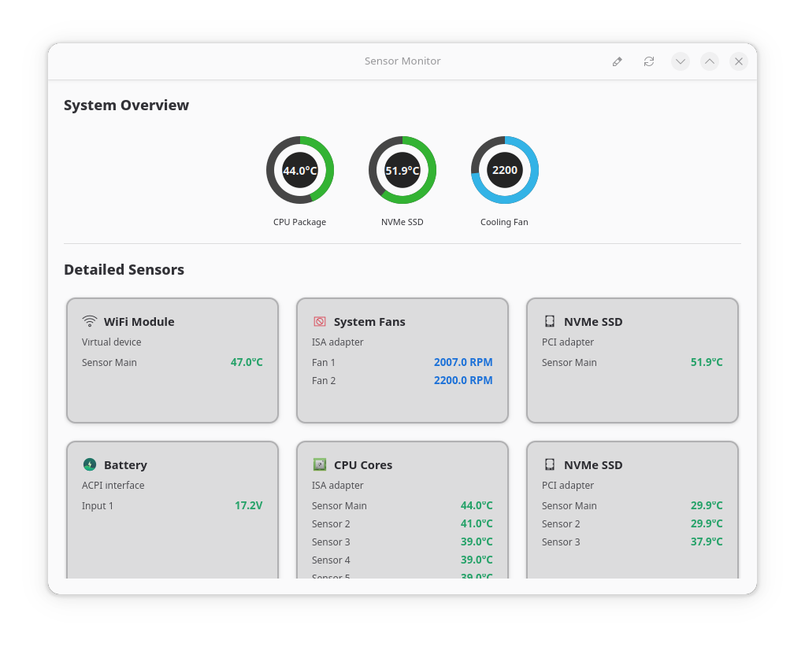

# System Sensor Monitor GTK

A beautiful, modern system sensor monitoring application built with GTK4 and Python. Monitor your CPU temperatures, NVMe SSD temperatures, fan speeds, and more with a sleek, real-time interface.



## Features

- 🌡️ **Real-time temperature monitoring** - CPU cores, NVMe SSDs, WiFi modules
- 🌪️ **Fan speed monitoring** - System fans with RPM readings
- 🔋 **Battery and voltage monitoring** - Battery voltage and power information
- 📊 **Circular progress indicators** - Visual overview of key metrics
- 🎨 **Modern GTK4 interface** - Native Linux design with dark/light theme support
- 🔄 **Auto-refresh** - Updates every 3 seconds
- 🎯 **Color-coded alerts** - Green (safe), orange (warm), red (hot)

## System Requirements

### Required Dependencies
- **Python 3.7+**
- **GTK4** with Python bindings (PyGObject)
- **libadwaita** for modern styling
- **lm-sensors** for hardware sensor data

### Supported Systems
- Most Linux distributions with lm-sensors support
- Tested on: Fedora, Ubuntu, Debian, Arch Linux, openSUSE

## Installation

### Fedora/RHEL/CentOS
```bash
# Install dependencies
sudo dnf install python3 python3-gobject gtk4 libadwaita lm-sensors

# Clone the repository
git clone https://github.com/YOUR_USERNAME/sensor-monitor-gtk.git
cd sensor-monitor-gtk

# Make executable and run
chmod +x sensor_monitor.py
python3 sensor_monitor.py
```

### Ubuntu/Debian
```bash
# Install dependencies
sudo apt update
sudo apt install python3 python3-gi gir1.2-gtk-4.0 gir1.2-adw-1 lm-sensors

# Clone the repository
git clone https://github.com/YOUR_USERNAME/sensor-monitor-gtk.git
cd sensor-monitor-gtk

# Make executable and run
chmod +x sensor_monitor.py
python3 sensor_monitor.py
```

### Arch Linux
```bash
# Install dependencies
sudo pacman -S python python-gobject gtk4 libadwaita lm_sensors

# Clone the repository
git clone https://github.com/YOUR_USERNAME/sensor-monitor-gtk.git
cd sensor-monitor-gtk

# Make executable and run
chmod +x sensor_monitor.py
python3 sensor_monitor.py
```

### First Time Setup
If this is your first time using lm-sensors, you may need to detect your sensors:
```bash
sudo sensors-detect
```
Follow the prompts and accept the defaults. Then test with:
```bash
sensors
```

## Usage

### Running the Application
```bash
python3 sensor_monitor.py
```

### Features
- **Refresh Button**: Manual refresh of sensor data
- **Debug Button**: Print raw sensor output to terminal for troubleshooting
- **Circular Indicators**: Real-time overview of CPU temp, NVMe temp, and fan speed
- **Sensor Cards**: Detailed breakdown by component type

### Keyboard Shortcuts
- **Ctrl+R**: Refresh sensors
- **Ctrl+Q**: Quit application

## Customization

### Modifying Update Interval
Edit line 177 in `sensor_monitor.py`:
```python
GLib.timeout_add_seconds(3, self.update_sensors)  # Change 3 to desired seconds
```

### Temperature Thresholds
Modify the color thresholds in the `_add_value_row` method:
```python
if temp > 80:      # Hot (red)
elif temp > 60:    # Warm (orange)
else:              # Cool (green)
```

## Troubleshooting

### No Sensor Data Displayed
1. **Check if lm-sensors is installed**: `sensors --version`
2. **Run sensor detection**: `sudo sensors-detect`
3. **Test sensors manually**: `sensors -u`
4. **Check permissions**: Ensure user can read `/sys/class/hwmon/`

### Missing Dependencies
If you get import errors:
```bash
# Check GTK4 installation
python3 -c "import gi; gi.require_version('Gtk', '4.0'); print('GTK4 OK')"

# Check Adwaita installation  
python3 -c "import gi; gi.require_version('Adw', '1'); print('Adwaita OK')"
```

### Application Won't Start
1. **Check Python version**: `python3 --version` (needs 3.7+)
2. **Check display server**: Works with X11 and Wayland
3. **Run with debug output**: `GTK_DEBUG=interactive python3 sensor_monitor.py`

## Contributing

Contributions are welcome! Please feel free to submit issues and pull requests.

### Development Setup
```bash
git clone https://github.com/YOUR_USERNAME/sensor-monitor-gtk.git
cd sensor-monitor-gtk

# Test your changes
python3 sensor_monitor.py
```

### Adding New Sensor Types
1. Modify the `parse_sensors_simple()` method to handle new sensor patterns
2. Add appropriate icons and display names in `update_sensors()`
3. Test with various hardware configurations

## License

This project is licensed under the MIT License - see the [LICENSE](LICENSE) file for details.

## Acknowledgments

- Built with [GTK4](https://www.gtk.org/) and [PyGObject](https://pygobject.readthedocs.io/)
- Uses [lm-sensors](https://github.com/lm-sensors/lm-sensors) for hardware monitoring
- Inspired by modern system monitoring tools

## Screenshots

### Main Interface


### Dark Theme


---

**⚡ Made with ❤️ for the Linux community**
